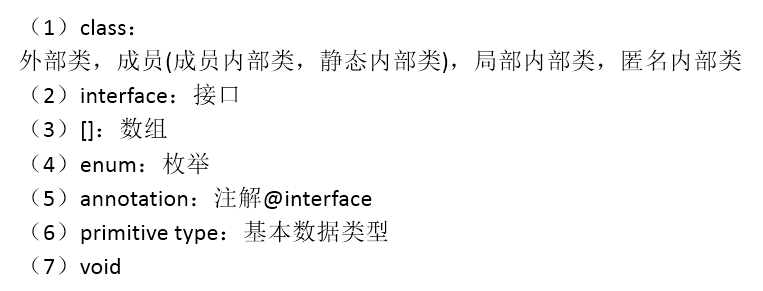

### 反射概念

[TOC]


> 代码在day11

#### 主要内容


#### Class类的理解

**1.类的加载过程：**

程序经过javac.exe命令以后，会生成一个或多个字节码文件(.class结尾)。
接着我们使用java.exe命令对某个字节码文件进行解释运行。相当于将某个字节码文件
加载到内存中。此过程就称为类的加载。加载到内存中的类，我们就称为运行时类，此
运行时类，就作为Class的一个实例。
**2.换句话说**，Class的实例就对应着一个运行时类。
**3.加载到内存中的运行时类**，会缓存一定的时间。在此时间之内，我们可以通过不同的方式
来获取此运行时类。


#### 关于反射的理解

**Reflection（反射)**是被视为==动态语言==的关键，反射机制允许程序在执行期借助于Reflection API取得任何
类的内部信息，并能直接操作任意对象的内部属性及方法。

**框架 = 反射 + 注解 + 设计模式。**


#### 获取Class实例的几种方法

1. **方式一：**调用运行时类的属性：.class
           

   ```java
   Class clazz1 = Person.class;
   System.out.println(clazz1);
   ```

   

2. **方式二：**通过运行时类的对象,调用getClass()
           

   ```java
   Person p1 = new Person();
   Class clazz2 = p1.getClass();
   System.out.println(clazz2);
   ```

   

3. **方式三：**调用Class的静态方法：forName(String classPath) **开发中较为常用的方法**
   		

   ```java
   Class clazz3 = Class.forName("com.atguigu.java.Person");
   
   //clazz3 = Class.forName("java.lang.String");
   System.out.println(clazz3);
   
   System.out.println(clazz1 == clazz2);
   System.out.println(clazz1 == clazz3);
   ```

   

4. **方式四：**使用类的加载器：ClassLoader  (了解)

   ```java
   ClassLoader classLoader = ReflectionTest.class.getClassLoader();
   Class clazz4 = classLoader.loadClass("com.atguigu.java.Person");
   System.out.println(clazz4);
   
   System.out.println(clazz1 == clazz4);
   ```


#### **总结：创建类的对象的方式?**

**方式一：**new + 构造器
**方式二：**要创建Xxx类的对象，可以考虑：Xxx、Xxxs、XxxFactory、XxxBuilder类中查看是否有
静态方法的存在。可以调用其静态方法，创建Xxx对象。
**方式三：**通过反射


#### Class实例可以是哪些结构的说明




**反射机制能提供的功能**


#### 相关API

java.lang.Class:反射的源头
java.lang.reflect.Method
java.lang.reflect.Field
java.lang.reflect.Constructor
....